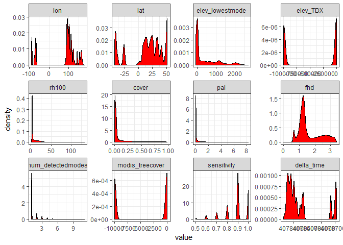
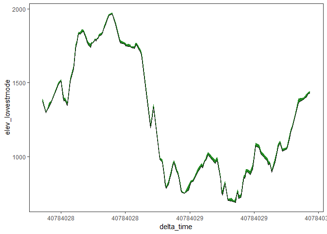
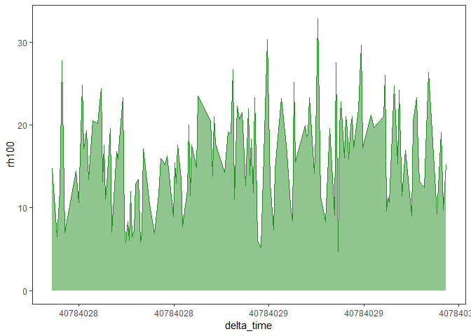
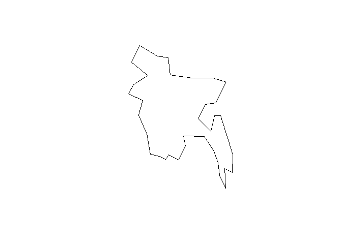
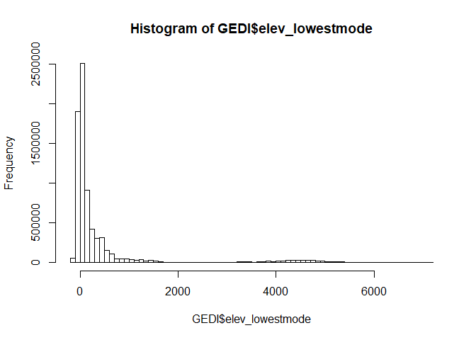
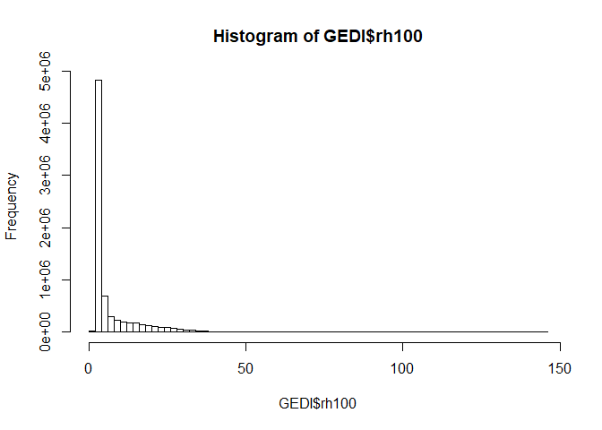
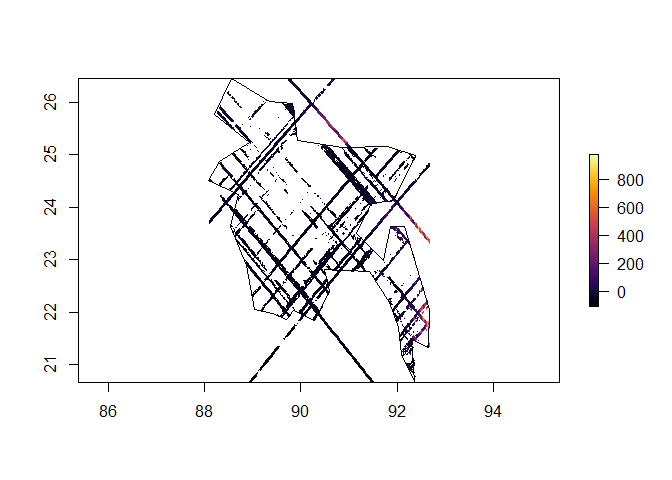
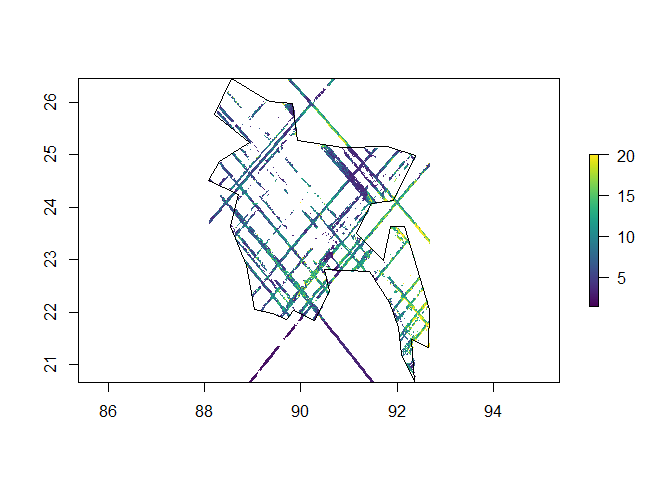

# Getting Started with Finding Available GEDI (from rGEDI tutorial page)

## Installation of rGEDI
```r
#The CRAN version:
install.packages("rGEDI")

#The development version:
library(devtools)
devtools::install_git("https://github.com/carlos-alberto-silva/rGEDI", dependencies = TRUE)

# loading rGEDI package
library(rGEDI)

```    

## Find GEDI data within your study area (GEDI finder tool)

```r
# Study area boundary box coordinates
ul_lat<- -44.0654
lr_lat<- -44.17246
ul_lon<- -13.76913
lr_lon<- -13.67646
```
Better yet, I like to import a raster or shapefile of the area of interest to grab the bounding coordinates like this:

```r
#pick your country of interest
countries<-rnaturalearth::ne_countries()

#read in a shapefile of interest
country<-readOGR("D:/US_conterminous_extent.shp")

#extent to get GEDI data
ext_bb<-extent(country)

# Study area boundary box coordinates (less manual. Woo!)
ul_lat<- ext_bb[c(4)]
lr_lat<- ext_bb[c(3)]
ul_lon<- ext_bb[c(1)]
lr_lon<- ext_bb[c(2)]
```

Note the date range of the data you desire. This might align with growing season or some other event of interest.
```r
# Specifying the date range
daterange=c("2019-07-01","2020-05-22")
```

Find available GEDI data:
```r
# Get path to GEDI data
gLevel1B<-gedifinder(product="GEDI01_B",ul_lat, ul_lon, lr_lat, lr_lon,version="001",daterange=daterange)
gLevel2A<-gedifinder(product="GEDI02_A",ul_lat, ul_lon, lr_lat, lr_lon,version="001",daterange=daterange)
gLevel2B<-gedifinder(product="GEDI02_B",ul_lat, ul_lon, lr_lat, lr_lon,version="001",daterange=daterange)
```
## Downloading GEDI data

Using rGEDI (this is slow!)
```r
# Set output dir for downloading the files
outdir=getwd()

# Downloading GEDI data
gediDownload(filepath=gLevel1B,outdir=outdir)
gediDownload(filepath=gLevel2A,outdir=outdir)
gediDownload(filepath=gLevel2B,outdir=outdir)
```
The method I have adopted uses Cygwin64 terminal to run a modified GEDI download bash script:
```r

gedi_ls<-gLevel2B

#this defines the ftp path, so we can sub in our local directory path
gedi_path<-as.vector(substr(gedi_ls,1,
                            nchar("https://e4ftl01.cr.usgs.gov/GEDI/GEDI02_B.001/2019.04.18/")))

#we modify the list so we know what we have already downloaded
gedi_ls<-as.vector(substr(gedi_ls, 
                          nchar("https://e4ftl01.cr.usgs.gov/GEDI/GEDI02_B.001/2019.04.18/")+1, 
                          200))

#remove GEDI files that are already downloaded to the local drive
gedi_ls_sub<-gedi_ls[!(gedi_ls %in% list.files("D:/GEDI/", pattern="h5"))]

#add the correct file path back to the files for downloading
gedi_ls_sub<-paste0(gedi_path[!(gedi_ls %in% list.files("D:/GEDI/", pattern="h5"))],gedi_ls_sub)

#write this file list
writeLines(gedi_ls_sub, "D:/GEDI/GEDI_ls_sub.txt")

```

Now (yes this is silly...) I paste the massive file list into the download bash script. Here's where using Nathan's method would be a winner if you could run it easily from R. I have tried automating the creation of this script without success. Maybe we can integrate these two methods for speed!


# Getting started preprocessing GEDI data

## Setup file

Now we will modify a simple setup file so we can blaze thorugh a bunch of GEDI data:


```r
library(h5)
```

```
## Warning: package 'h5' was built under R version 3.6.1
```

```r
source("R/GEDI_processing_FUN.R")
beams<-c("0000","0001","0010","0011",
         "0101","0110", "1000", "1011")

GEDI.dir<-"D:/GEDI/"
output.dir<-"D:/GEDI/output/"

file_ls<-subset.files(GEDI.dir, output.dir)
```

Here we want to modify the directory where we find the GEDI data (`GEDI.dir`) and where the new text files will be written (`output.dir`). `subset.files()` simply makes sure you are not re-processing h5 GEDI files that already exist.

## GEDI data structure
First, let's take a look 

```r
print(file_ls[1:4])
```

```
## [1] "D:/GEDI/GEDI02_B_2019146011955_O02550_T02940_02_001_01.h5"
## [2] "D:/GEDI/GEDI02_B_2019162192037_O02810_T02818_02_001_01.h5"
## [3] "D:/GEDI/GEDI02_B_2019175054509_O03003_T00196_02_001_01.h5"
## [4] "D:/GEDI/GEDI02_B_2019179101505_O03068_T05540_02_001_01.h5"
```

For an example of the GEDI data structure I'm going to choose a single orbit that overlaps with Gabon and Pongara National Park:


```r
file_ls<-"E:/Gabon/GEDI/current_release_correct/GEDI02_B_2019111040155_O02008_T04616_02_001_01.h5"
```

Normally, this portion of the script is included in a loop or similar, but this is the basic method of reading h5 GEDI data in:


```r
i=1

file <- h5::h5file(name = file_ls[i],
                 mode = "a")
```

Now that we have a GEDI file in R we need to look at the stucture. It has a very complex hierarchical structure:


```r
  data.sets<-h5::list.datasets(file)

data.sets[1:180]
```

```
##   [1] "/BEAM0000/algorithmrun_flag"                       
##   [2] "/BEAM0000/ancillary/dz"                            
##   [3] "/BEAM0000/ancillary/l2a_alg_count"                 
##   [4] "/BEAM0000/ancillary/maxheight_cuttoff"             
##   [5] "/BEAM0000/ancillary/rg_eg_constraint_center_buffer"
##   [6] "/BEAM0000/ancillary/rg_eg_mpfit_max_func_evals"    
##   [7] "/BEAM0000/ancillary/rg_eg_mpfit_maxiters"          
##   [8] "/BEAM0000/ancillary/rg_eg_mpfit_tolerance"         
##   [9] "/BEAM0000/ancillary/signal_search_buff"            
##  [10] "/BEAM0000/ancillary/tx_noise_stddev_multiplier"    
##  [11] "/BEAM0000/beam"                                    
##  [12] "/BEAM0000/channel"                                 
##  [13] "/BEAM0000/cover"                                   
##  [14] "/BEAM0000/cover_z"                                 
##  [15] "/BEAM0000/delta_time"                              
##  [16] "/BEAM0000/fhd_normal"                              
##  [17] "/BEAM0000/geolocation/degrade_flag"                
##  [18] "/BEAM0000/geolocation/delta_time"                  
##  [19] "/BEAM0000/geolocation/digital_elevation_model"     
##  [20] "/BEAM0000/geolocation/elev_highestreturn"          
##  [21] "/BEAM0000/geolocation/elev_lowestmode"             
##  [22] "/BEAM0000/geolocation/elevation_bin0"              
##  [23] "/BEAM0000/geolocation/elevation_bin0_error"        
##  [24] "/BEAM0000/geolocation/elevation_lastbin"           
##  [25] "/BEAM0000/geolocation/elevation_lastbin_error"     
##  [26] "/BEAM0000/geolocation/height_bin0"                 
##  [27] "/BEAM0000/geolocation/height_lastbin"              
##  [28] "/BEAM0000/geolocation/lat_highestreturn"           
##  [29] "/BEAM0000/geolocation/lat_lowestmode"              
##  [30] "/BEAM0000/geolocation/latitude_bin0"               
##  [31] "/BEAM0000/geolocation/latitude_bin0_error"         
##  [32] "/BEAM0000/geolocation/latitude_lastbin"            
##  [33] "/BEAM0000/geolocation/latitude_lastbin_error"      
##  [34] "/BEAM0000/geolocation/local_beam_azimuth"          
##  [35] "/BEAM0000/geolocation/local_beam_elevation"        
##  [36] "/BEAM0000/geolocation/lon_highestreturn"           
##  [37] "/BEAM0000/geolocation/lon_lowestmode"              
##  [38] "/BEAM0000/geolocation/longitude_bin0"              
##  [39] "/BEAM0000/geolocation/longitude_bin0_error"        
##  [40] "/BEAM0000/geolocation/longitude_lastbin"           
##  [41] "/BEAM0000/geolocation/longitude_lastbin_error"     
##  [42] "/BEAM0000/geolocation/shot_number"                 
##  [43] "/BEAM0000/geolocation/solar_azimuth"               
##  [44] "/BEAM0000/geolocation/solar_elevation"             
##  [45] "/BEAM0000/l2a_quality_flag"                        
##  [46] "/BEAM0000/l2b_quality_flag"                        
##  [47] "/BEAM0000/land_cover_data/landsat_treecover"       
##  [48] "/BEAM0000/land_cover_data/modis_nonvegetated"      
##  [49] "/BEAM0000/land_cover_data/modis_nonvegetated_sd"   
##  [50] "/BEAM0000/land_cover_data/modis_treecover"         
##  [51] "/BEAM0000/land_cover_data/modis_treecover_sd"      
##  [52] "/BEAM0000/master_frac"                             
##  [53] "/BEAM0000/master_int"                              
##  [54] "/BEAM0000/num_detectedmodes"                       
##  [55] "/BEAM0000/omega"                                   
##  [56] "/BEAM0000/pai"                                     
##  [57] "/BEAM0000/pai_z"                                   
##  [58] "/BEAM0000/pavd_z"                                  
##  [59] "/BEAM0000/pgap_theta"                              
##  [60] "/BEAM0000/pgap_theta_error"                        
##  [61] "/BEAM0000/pgap_theta_z"                            
##  [62] "/BEAM0000/rg"                                      
##  [63] "/BEAM0000/rh100"                                   
##  [64] "/BEAM0000/rhog"                                    
##  [65] "/BEAM0000/rhog_error"                              
##  [66] "/BEAM0000/rhov"                                    
##  [67] "/BEAM0000/rhov_error"                              
##  [68] "/BEAM0000/rossg"                                   
##  [69] "/BEAM0000/rv"                                      
##  [70] "/BEAM0000/rx_processing/algorithmrun_flag_a1"      
##  [71] "/BEAM0000/rx_processing/algorithmrun_flag_a2"      
##  [72] "/BEAM0000/rx_processing/algorithmrun_flag_a3"      
##  [73] "/BEAM0000/rx_processing/algorithmrun_flag_a4"      
##  [74] "/BEAM0000/rx_processing/algorithmrun_flag_a5"      
##  [75] "/BEAM0000/rx_processing/algorithmrun_flag_a6"      
##  [76] "/BEAM0000/rx_processing/pgap_theta_a1"             
##  [77] "/BEAM0000/rx_processing/pgap_theta_a2"             
##  [78] "/BEAM0000/rx_processing/pgap_theta_a3"             
##  [79] "/BEAM0000/rx_processing/pgap_theta_a4"             
##  [80] "/BEAM0000/rx_processing/pgap_theta_a5"             
##  [81] "/BEAM0000/rx_processing/pgap_theta_a6"             
##  [82] "/BEAM0000/rx_processing/pgap_theta_error_a1"       
##  [83] "/BEAM0000/rx_processing/pgap_theta_error_a2"       
##  [84] "/BEAM0000/rx_processing/pgap_theta_error_a3"       
##  [85] "/BEAM0000/rx_processing/pgap_theta_error_a4"       
##  [86] "/BEAM0000/rx_processing/pgap_theta_error_a5"       
##  [87] "/BEAM0000/rx_processing/pgap_theta_error_a6"       
##  [88] "/BEAM0000/rx_processing/rg_a1"                     
##  [89] "/BEAM0000/rx_processing/rg_a2"                     
##  [90] "/BEAM0000/rx_processing/rg_a3"                     
##  [91] "/BEAM0000/rx_processing/rg_a4"                     
##  [92] "/BEAM0000/rx_processing/rg_a5"                     
##  [93] "/BEAM0000/rx_processing/rg_a6"                     
##  [94] "/BEAM0000/rx_processing/rg_eg_amplitude_a1"        
##  [95] "/BEAM0000/rx_processing/rg_eg_amplitude_a2"        
##  [96] "/BEAM0000/rx_processing/rg_eg_amplitude_a3"        
##  [97] "/BEAM0000/rx_processing/rg_eg_amplitude_a4"        
##  [98] "/BEAM0000/rx_processing/rg_eg_amplitude_a5"        
##  [99] "/BEAM0000/rx_processing/rg_eg_amplitude_a6"        
## [100] "/BEAM0000/rx_processing/rg_eg_amplitude_error_a1"  
## [101] "/BEAM0000/rx_processing/rg_eg_amplitude_error_a2"  
## [102] "/BEAM0000/rx_processing/rg_eg_amplitude_error_a3"  
## [103] "/BEAM0000/rx_processing/rg_eg_amplitude_error_a4"  
## [104] "/BEAM0000/rx_processing/rg_eg_amplitude_error_a5"  
## [105] "/BEAM0000/rx_processing/rg_eg_amplitude_error_a6"  
## [106] "/BEAM0000/rx_processing/rg_eg_center_a1"           
## [107] "/BEAM0000/rx_processing/rg_eg_center_a2"           
## [108] "/BEAM0000/rx_processing/rg_eg_center_a3"           
## [109] "/BEAM0000/rx_processing/rg_eg_center_a4"           
## [110] "/BEAM0000/rx_processing/rg_eg_center_a5"           
## [111] "/BEAM0000/rx_processing/rg_eg_center_a6"           
## [112] "/BEAM0000/rx_processing/rg_eg_center_error_a1"     
## [113] "/BEAM0000/rx_processing/rg_eg_center_error_a2"     
## [114] "/BEAM0000/rx_processing/rg_eg_center_error_a3"     
## [115] "/BEAM0000/rx_processing/rg_eg_center_error_a4"     
## [116] "/BEAM0000/rx_processing/rg_eg_center_error_a5"     
## [117] "/BEAM0000/rx_processing/rg_eg_center_error_a6"     
## [118] "/BEAM0000/rx_processing/rg_eg_chisq_a1"            
## [119] "/BEAM0000/rx_processing/rg_eg_chisq_a2"            
## [120] "/BEAM0000/rx_processing/rg_eg_chisq_a3"            
## [121] "/BEAM0000/rx_processing/rg_eg_chisq_a4"            
## [122] "/BEAM0000/rx_processing/rg_eg_chisq_a5"            
## [123] "/BEAM0000/rx_processing/rg_eg_chisq_a6"            
## [124] "/BEAM0000/rx_processing/rg_eg_flag_a1"             
## [125] "/BEAM0000/rx_processing/rg_eg_flag_a2"             
## [126] "/BEAM0000/rx_processing/rg_eg_flag_a3"             
## [127] "/BEAM0000/rx_processing/rg_eg_flag_a4"             
## [128] "/BEAM0000/rx_processing/rg_eg_flag_a5"             
## [129] "/BEAM0000/rx_processing/rg_eg_flag_a6"             
## [130] "/BEAM0000/rx_processing/rg_eg_gamma_a1"            
## [131] "/BEAM0000/rx_processing/rg_eg_gamma_a2"            
## [132] "/BEAM0000/rx_processing/rg_eg_gamma_a3"            
## [133] "/BEAM0000/rx_processing/rg_eg_gamma_a4"            
## [134] "/BEAM0000/rx_processing/rg_eg_gamma_a5"            
## [135] "/BEAM0000/rx_processing/rg_eg_gamma_a6"            
## [136] "/BEAM0000/rx_processing/rg_eg_gamma_error_a1"      
## [137] "/BEAM0000/rx_processing/rg_eg_gamma_error_a2"      
## [138] "/BEAM0000/rx_processing/rg_eg_gamma_error_a3"      
## [139] "/BEAM0000/rx_processing/rg_eg_gamma_error_a4"      
## [140] "/BEAM0000/rx_processing/rg_eg_gamma_error_a5"      
## [141] "/BEAM0000/rx_processing/rg_eg_gamma_error_a6"      
## [142] "/BEAM0000/rx_processing/rg_eg_niter_a1"            
## [143] "/BEAM0000/rx_processing/rg_eg_niter_a2"            
## [144] "/BEAM0000/rx_processing/rg_eg_niter_a3"            
## [145] "/BEAM0000/rx_processing/rg_eg_niter_a4"            
## [146] "/BEAM0000/rx_processing/rg_eg_niter_a5"            
## [147] "/BEAM0000/rx_processing/rg_eg_niter_a6"            
## [148] "/BEAM0000/rx_processing/rg_eg_sigma_a1"            
## [149] "/BEAM0000/rx_processing/rg_eg_sigma_a2"            
## [150] "/BEAM0000/rx_processing/rg_eg_sigma_a3"            
## [151] "/BEAM0000/rx_processing/rg_eg_sigma_a4"            
## [152] "/BEAM0000/rx_processing/rg_eg_sigma_a5"            
## [153] "/BEAM0000/rx_processing/rg_eg_sigma_a6"            
## [154] "/BEAM0000/rx_processing/rg_eg_sigma_error_a1"      
## [155] "/BEAM0000/rx_processing/rg_eg_sigma_error_a2"      
## [156] "/BEAM0000/rx_processing/rg_eg_sigma_error_a3"      
## [157] "/BEAM0000/rx_processing/rg_eg_sigma_error_a4"      
## [158] "/BEAM0000/rx_processing/rg_eg_sigma_error_a5"      
## [159] "/BEAM0000/rx_processing/rg_eg_sigma_error_a6"      
## [160] "/BEAM0000/rx_processing/rg_error_a1"               
## [161] "/BEAM0000/rx_processing/rg_error_a2"               
## [162] "/BEAM0000/rx_processing/rg_error_a3"               
## [163] "/BEAM0000/rx_processing/rg_error_a4"               
## [164] "/BEAM0000/rx_processing/rg_error_a5"               
## [165] "/BEAM0000/rx_processing/rg_error_a6"               
## [166] "/BEAM0000/rx_processing/rv_a1"                     
## [167] "/BEAM0000/rx_processing/rv_a2"                     
## [168] "/BEAM0000/rx_processing/rv_a3"                     
## [169] "/BEAM0000/rx_processing/rv_a4"                     
## [170] "/BEAM0000/rx_processing/rv_a5"                     
## [171] "/BEAM0000/rx_processing/rv_a6"                     
## [172] "/BEAM0000/rx_processing/rx_energy_a1"              
## [173] "/BEAM0000/rx_processing/rx_energy_a2"              
## [174] "/BEAM0000/rx_processing/rx_energy_a3"              
## [175] "/BEAM0000/rx_processing/rx_energy_a4"              
## [176] "/BEAM0000/rx_processing/rx_energy_a5"              
## [177] "/BEAM0000/rx_processing/rx_energy_a6"              
## [178] "/BEAM0000/rx_processing/shot_number"               
## [179] "/BEAM0000/rx_range_highestreturn"                  
## [180] "/BEAM0000/rx_sample_count"
```


**WOW!** That is a lot of info to grab (180 categories X 8 beams!). So you need to choose what is important to you for processing.

Now, within each beam we can subset by the specific data we need. 

# GEDI Preprocessing
## Preprocessing Function
Ideally we want to do all of this automatically for lots of GEDI data, so we can use this simple function:

```r
preprocess.GEDI(input.file=x, 
                      filename=filename)
```

`preprocess.GEDI` takes h5 files, selects useful metrics, and outputs a simple txt file for further processing. This greatly simplifies the pipeline. We can modify this function to include specific information from the h5 file, but for now it includes: 

"lon"
"lat"
"elev_lowestmode"
"elev_TDX"
"rh100"
"cover"
"pai"
"fhd"
"num_detectedmodes"
"modis_treecover"
"q1" "surface_flag"
"sensitivity" 
"shot_number" "delta_time"
"beam"

I find these variables give me everything I need from the L2B data product.

## Process in parallel

Now we can use the `parallel` package to process everything with lightning speeds!

```r
library(parallel)
# Calculate the number of cores
no_cores <- detectCores() - 1

# Initiate cluster
cl <- makeCluster(no_cores)

parLapply(cl, file_ls, function(x){
  
  source("R/GEDI_setup.R")
  
  filename<-gsub(".h5",".txt", 
                 gsub(GEDI.dir,output.dir, x) )
  
  try(preprocess.GEDI(input.file=x, 
                      filename=filename), silent=TRUE)
})

stopCluster(cl)

```
Check the output directory to see the GEDI files being written to your drive.

## Read a processed GEDI .txt file

Now we can easily use the preprocessed GEDI data to do some science.


```r
#Get our processed GEDI files
GEDI.processed.files<-list.files(output.dir, pattern="txt", full.names = TRUE)

library(data.table)
#read a single orbit file in
GEDI<-data.table::fread(GEDI.processed.files[1])

#subset to "quality 1" shots (the good ones!)
GEDI<-GEDI[GEDI$q1==1,]

#load some some packages for viz
library(ggplot2)
```

```
## Registered S3 methods overwritten by 'ggplot2':
##   method         from 
##   [.quosures     rlang
##   c.quosures     rlang
##   print.quosures rlang
```

```r
library(reshape)
```

```
## 
## Attaching package: 'reshape'
```

```
## The following object is masked from 'package:data.table':
## 
##     melt
```

```r
GEDI.long<-melt(GEDI, id.vars="shot_number", measure.vars = colnames(GEDI)[-c(11,12,14, 16)])

ggplot(GEDI.long,
       aes(x=value))+
  geom_density(fill="red", color="black")+
  facet_wrap(~variable, scales="free")+
  theme_bw()
```

<!-- -->

With this we can see the distribution of values for each variable. Now we can visualize some GEDI transects:


Let's take a look at the profiles with elevation and canopy height:


```r
ggplot(GEDI.sub[order(GEDI.sub$delta_time),],
       aes(x=delta_time,y=elev_lowestmode))+
  
  geom_ribbon(aes(ymin=elev_lowestmode,ymax=rh100+elev_lowestmode),
              fill="forestgreen")+
  geom_path(aes(y=rh100+elev_lowestmode), color="forestgreen")+
  geom_path(color="black", size=0.1)+
  theme_bw()+theme(panel.grid = element_blank())
```

<!-- -->

```r
ggplot(GEDI.sub[order(GEDI.sub$delta_time),],
       aes(x=delta_time,y=rh100))+
  geom_ribbon(aes(ymin=0,ymax=rh100),
              fill="forestgreen", alpha=0.5)+
  geom_path(color="forestgreen")+
  theme_bw()+theme(panel.grid = element_blank())
```

<!-- -->

Where are we??? Let's look in a map:

```
## Warning: package 'leaflet' was built under R version 3.6.3
```

<!--html_preserve--><div id="htmlwidget-d8f76274497ce3772f74" style="width:672px;height:480px;" class="leaflet html-widget"></div>
<script type="application/json" data-for="htmlwidget-d8f76274497ce3772f74">{"x":{"options":{"crs":{"crsClass":"L.CRS.EPSG3857","code":null,"proj4def":null,"projectedBounds":null,"options":{}}},"calls":[{"method":"addCircleMarkers","args":[[31.595045478311,31.5961702058475,31.5969005417173,31.5972619906899,31.5979969776128,31.6005480592545,31.6012813853106,31.6020391924999,31.6024153832997,31.6027822827332,31.6031553092985,31.6035284397305,31.6045949272047,31.6056817497634,31.6063857300776,31.6067471202764,31.6071048477306,31.6074706848006,31.6078402741229,31.6085720714656,31.608940993798,31.6100563159958,31.610429674685,31.6108008491339,31.6115391242746,31.6119045739218,31.6122728156579,31.6126380670778,31.6130034538758,31.6133726928569,31.6137396484838,31.6141069445615,31.6144698002659,31.6152046211565,31.6155719766486,31.6159354857997,31.6162982803181,31.6177546111528,31.6188581002738,31.6199759121349,31.6203489503636,31.6211009560683,31.6214760988792,31.6218481334758,31.623325479664,31.6236951073929,31.6240649411801,31.6244330076088,31.6251712199392,31.6255423236292,31.6266485573105,31.6270121083366,31.627380131788,31.6277512183451,31.6288660727667,31.6292403032506,31.6322954056229,31.6326558664506,31.6330130534346,31.6333701012662,31.6356607622496,31.6364000538704,31.6371572258811,31.6375381662523,31.6379146822254,31.6386424261157,31.6390037889899,31.6397292421056,31.6400899382668,31.640452488953,31.6411969792581,31.6415716658209,31.641941429172,31.6423201433884,31.6426954663277,31.6430734442125,31.6434453394132,31.6441833320999,31.6456456432721,31.646374154276,31.6471101548289,31.6474747148587,31.6489314796334,31.6500290442333,31.6503998710177,31.6511272185966,31.6514938099673,31.6518562192209,31.6522192111331,31.6544358444451,31.6548054640665,31.6551692288661,31.6555362201933,31.6566689724533,31.6570562124352,31.6574243561866,31.6581467853463,31.6592771474692,31.6603792900506,31.6614876928578,31.6618517699379,31.6622128446351,31.6625754355423,31.6629517231156,31.6636869819031,31.6640441833781,31.6644014914202,31.6647619247907,31.6651299448341,31.6654897080834,31.6658573738396,31.6669648649544,31.6676902916277,31.6680493534145,31.6687618438925,31.6698682821623,31.6706134614814,31.6728304317674,31.6732025919948,31.6735718492503,31.6739453916542,31.6743204491389,31.6754052341346,31.6761280338264,31.6764871832203,31.6772186211188,31.6779656857592,31.6794357212684,31.6797967902093,31.6805195174284,31.6808805365044,31.6812430588425,31.6823296487948,31.6834088182446,31.6852467026561,31.6863431992694,31.6867089694731,31.6874409597033],[109.775856416662,109.777127348724,109.777969186604,109.778389046449,109.7792320033,109.78217587069,109.783018071455,109.783866955319,109.784290646544,109.784711787959,109.785134608425,109.785557458264,109.786811521763,109.788071229417,109.788905450791,109.789325158285,109.789743873556,109.790164825676,109.79058681906,109.791428816377,109.791850662386,109.79311861536,109.793541723099,109.793964242446,109.794808195454,109.795229175139,109.795650970262,109.796071993213,109.79649306324,109.796915200166,109.797336719792,109.797758341823,109.798178754252,109.799022106261,109.799443779399,109.799864404705,109.800284841009,109.801968065742,109.803233628425,109.804503162383,109.804926466687,109.805774710587,109.806198599649,109.806621635996,109.808310608728,109.808732906755,109.809155259986,109.809577125326,109.810421414429,109.810844099599,109.812110161249,109.812530734448,109.812952524796,109.813375144297,109.814643351123,109.815066771117,109.81847020091,109.818889623671,109.819308118143,109.819726549549,109.822277623644,109.823121275125,109.823969875123,109.824394843182,109.824818613153,109.825659267387,109.82607894665,109.826919156796,109.827338761746,109.827758920527,109.82860471636,109.829028366109,109.829450717976,109.829875587206,109.830299575041,109.830724341647,109.831147479563,109.831992282758,109.83367852262,109.834521061315,109.835365724009,109.835787124396,109.837472347107,109.838737577434,109.839160661433,109.840002831816,109.84042469292,109.840845385356,109.841266222846,109.843801654133,109.84422424658,109.844645220492,109.845067079915,109.846341405359,109.846768881914,109.847191137442,109.848031843274,109.849305830177,109.850572126585,109.851840216762,109.852261435972,109.852681830122,109.853102642901,109.853527231785,109.854371629244,109.854790946837,109.855210287789,109.855630483964,109.85605276394,109.85647275754,109.856894919313,109.858162567527,109.859003896391,109.85942351516,109.860261139996,109.86152784353,109.862374325642,109.864908448198,109.865331524781,109.865753800404,109.866177260517,109.866601142478,109.867861680169,109.868701977624,109.869121523614,109.869964287348,109.87081143199,109.872499282317,109.872919511868,109.873760187684,109.874180457347,109.874601160096,109.87586310969,109.877123177434,109.879234512347,109.880499823541,109.88092170623,109.881765646575],1,null,null,{"interactive":true,"className":"","stroke":true,"color":["#A4CCE3","#EBF3FB","#C2D9ED","#155EA7","#E7F1FA","#A8CEE4","#CEE0F2","#2C7ABA","#83BBDB","#78B5D9","#65A9D3","#B3D3E8","#58A0CE","#5CA3D0","#307EBC","#B6D4E9","#7DB7DA","#CBDEF1","#B9D5EA","#62A7D2","#E6F0FA","#89BEDC","#96C5DF","#72B1D7","#3A88C1","#E2EEF8","#EFF6FD","#DDEAF7","#EDF5FC","#C4DAEE","#EAF3FB","#E5F0F9","#B9D5EA","#B3D3E8","#EFF6FC","#E8F1FA","#83BBDB","#D0E1F2","#E7F1FA","#C7DCEF","#95C5DF","#9AC8E0","#9FCAE1","#90C2DE","#D9E8F5","#9CC9E1","#B8D5EA","#7EB8DA","#B3D3E8","#E2EDF8","#C1D9ED","#5DA4D0","#C8DCF0","#7DB7DA","#A3CCE3","#3887C0","#58A0CE","#AED1E7","#529CCC","#7BB6D9","#A9CFE5","#67ABD4","#69ACD5","#1C69AF","#CBDEF1","#4292C6","#569FCD","#4C98CA","#76B4D8","#BCD7EB","#4795C8","#AED0E6","#72B1D7","#C5DBEF","#3A89C1","#98C7E0","#EEF5FC","#F3F9FE","#09478E","#B9D5EA","#E5EFF9","#A5CDE3","#3B89C2","#7EB8DA","#9DC9E1","#D0E1F2","#DCEAF6","#2877B8","#9BC8E0","#5EA4D1","#6EAFD7","#69ADD5","#3A89C1","#AACFE5","#6BAED6","#08306B","#C9DDF0","#DDEAF7","#62A7D2","#D8E7F5","#1761A8","#F7FBFF","#60A6D1","#3E8DC4","#93C4DF","#529CCC","#64A9D3","#96C5DF","#5FA5D1","#529CCC","#82BADB","#4895C8","#084D97","#83BADB","#69ADD5","#509BCB","#62A7D2","#529CCC","#206FB4","#D5E5F4","#C9DDF0","#CEE0F2","#2D7BBA","#9ECAE1","#317FBC","#C8DDF0","#87BDDC","#D9E7F5","#59A1CF","#3A89C1","#87BDDC","#B6D4E9","#BDD7EC","#1E6CB1","#D7E6F5","#68ABD5","#D3E4F3","#9FCAE1"],"weight":5,"opacity":1,"fill":true,"fillColor":["#A4CCE3","#EBF3FB","#C2D9ED","#155EA7","#E7F1FA","#A8CEE4","#CEE0F2","#2C7ABA","#83BBDB","#78B5D9","#65A9D3","#B3D3E8","#58A0CE","#5CA3D0","#307EBC","#B6D4E9","#7DB7DA","#CBDEF1","#B9D5EA","#62A7D2","#E6F0FA","#89BEDC","#96C5DF","#72B1D7","#3A88C1","#E2EEF8","#EFF6FD","#DDEAF7","#EDF5FC","#C4DAEE","#EAF3FB","#E5F0F9","#B9D5EA","#B3D3E8","#EFF6FC","#E8F1FA","#83BBDB","#D0E1F2","#E7F1FA","#C7DCEF","#95C5DF","#9AC8E0","#9FCAE1","#90C2DE","#D9E8F5","#9CC9E1","#B8D5EA","#7EB8DA","#B3D3E8","#E2EDF8","#C1D9ED","#5DA4D0","#C8DCF0","#7DB7DA","#A3CCE3","#3887C0","#58A0CE","#AED1E7","#529CCC","#7BB6D9","#A9CFE5","#67ABD4","#69ACD5","#1C69AF","#CBDEF1","#4292C6","#569FCD","#4C98CA","#76B4D8","#BCD7EB","#4795C8","#AED0E6","#72B1D7","#C5DBEF","#3A89C1","#98C7E0","#EEF5FC","#F3F9FE","#09478E","#B9D5EA","#E5EFF9","#A5CDE3","#3B89C2","#7EB8DA","#9DC9E1","#D0E1F2","#DCEAF6","#2877B8","#9BC8E0","#5EA4D1","#6EAFD7","#69ADD5","#3A89C1","#AACFE5","#6BAED6","#08306B","#C9DDF0","#DDEAF7","#62A7D2","#D8E7F5","#1761A8","#F7FBFF","#60A6D1","#3E8DC4","#93C4DF","#529CCC","#64A9D3","#96C5DF","#5FA5D1","#529CCC","#82BADB","#4895C8","#084D97","#83BADB","#69ADD5","#509BCB","#62A7D2","#529CCC","#206FB4","#D5E5F4","#C9DDF0","#CEE0F2","#2D7BBA","#9ECAE1","#317FBC","#C8DDF0","#87BDDC","#D9E7F5","#59A1CF","#3A89C1","#87BDDC","#B6D4E9","#BDD7EC","#1E6CB1","#D7E6F5","#68ABD5","#D3E4F3","#9FCAE1"],"fillOpacity":0.2},null,null,null,null,null,{"interactive":false,"permanent":false,"direction":"auto","opacity":1,"offset":[0,0],"textsize":"10px","textOnly":false,"className":"","sticky":true},null]},{"method":"addScaleBar","args":[{"imperial":false,"position":"topright"}]},{"method":"addProviderTiles","args":["Esri.WorldImagery",null,null,{"errorTileUrl":"","noWrap":false,"detectRetina":false}]},{"method":"addLegend","args":[{"colors":["blue"],"labels":["GEDI Shots"],"na_color":null,"na_label":"NA","opacity":0.5,"position":"topright","type":"unknown","title":"GEDI Level2B","extra":null,"layerId":null,"className":"info legend","group":null}]}],"limits":{"lat":[31.595045478311,31.6874409597033],"lng":[109.775856416662,109.881765646575]}},"evals":[],"jsHooks":[]}</script><!--/html_preserve-->

# Gridding GEDI data

Now that we have a bunch of GEDI data processed we can get to work on gridding some GEDI variables. Let's focus on elevation and canopy height (rh100) for this tutorial.

First we decide where we want to grid the GEDI data...

In honor of the acceped paper, let's check out Bangladesh!


```
## Loading required package: sp
```

```
## rgdal: version: 1.4-4, (SVN revision 833)
##  Geospatial Data Abstraction Library extensions to R successfully loaded
##  Loaded GDAL runtime: GDAL 2.2.3, released 2017/11/20
##  Path to GDAL shared files: C:/Users/aestoval/Documents/R/R-3.6.0/library/rgdal/gdal
##  GDAL binary built with GEOS: TRUE 
##  Loaded PROJ.4 runtime: Rel. 4.9.3, 15 August 2016, [PJ_VERSION: 493]
##  Path to PROJ.4 shared files: C:/Users/aestoval/Documents/R/R-3.6.0/library/rgdal/proj
##  Linking to sp version: 1.3-1
```

```
## 
## Attaching package: 'raster'
```

```
## The following object is masked from 'package:data.table':
## 
##     shift
```

<!-- -->

Here we just got a list of GEDI files available in Bangladesh and subset based on the files we have available locally.

Now, want to put all of the GEDI shots within Bangladesh in one file before we grid. First, we decide on variables and output file name:


```r
#What are the variables we can choose from?
vars<-colnames(data.table::fread(GEDI_files[1], nrow=1))[-(1:2)]
print(vars)
```

```
##  [1] "elev_lowestmode"   "elev_TDX"          "rh100"            
##  [4] "cover"             "pai"               "fhd"              
##  [7] "num_detectedmodes" "modis_treecover"   "q1"               
## [10] "surface_flag"      "sensitivity"       "shot_number"      
## [13] "delta_time"        "beam"
```

```r
#choose the variables you want
output_variables<-vars[c(1,3)]

#Name the output file based on the project and variables included
Q1_output_file<-paste("D:/GEDI/output/rasters/Bangladesh_",
                      paste(output_variables, collapse = "_"),".txt", sep="")
```


Now, we iteratively open GEDI txt files, clip the orbits, and save as a single new file:

```r


library(sp)

for (i in 1:length(gedi_ls_sub)) {
  GEDI_df<-na.omit(data.table::fread(gedi_ls_sub[i], 
                             sep=" ", 
                             select = c('lon','lat',output_variables,'q1'), 
                             showProgress = FALSE))
  GEDI_sp<-SpatialPointsDataFrame(GEDI_df[,1:2],data=GEDI_df)
  GEDI_sp<-crop(GEDI_sp, country)
  
  if(is.null(GEDI_sp)) next else {
    GEDI_df<-GEDI_sp@data
  
  data.table::fwrite(GEDI_df[GEDI_df$q1==1,1:(ncol(GEDI_df)-1)], 
                     file = Q1_output_file,
                     sep = " ",
                     na = "NA",
                     append=TRUE)
  }
  
  print(paste0((i/length(gedi_ls_sub))*100,' %'))
} 


```

Now we can read our newly created file and take a look:


```r
GEDI<-fread(Q1_output_file)

hist(GEDI$elev_lowestmode, breaks=100)
```

<!-- -->

```r
hist(GEDI$rh100, breaks=100)
```

<!-- -->


Finally, we can easily convert the GEDI shots into spatial points and rasterize them to a grid resolution of our choice:


```r
GEDI_sp<-SpatialPointsDataFrame(coords=cbind(GEDI[,1],GEDI[,2]),
                                data=GEDI)


library(raster)
r<-raster(ext=extent(country), resolution=0.01)
GEDI_r<-rasterize(GEDI_sp, r, field="elev_lowestmode",fun=function(x, na.rm=TRUE) mean(x))
GEDI_rh100<-rasterize(GEDI_sp, r, field="rh100",fun=function(x, na.rm=TRUE) mean(x))


plot(GEDI_r, col=viridis::inferno(250))
plot(country, add=TRUE)
```

<!-- -->

```r
GEDI_rh100[GEDI_rh100>20]<-20
plot(GEDI_rh100,col=viridis::viridis(250))
plot(country, add=TRUE)
```

<!-- -->

